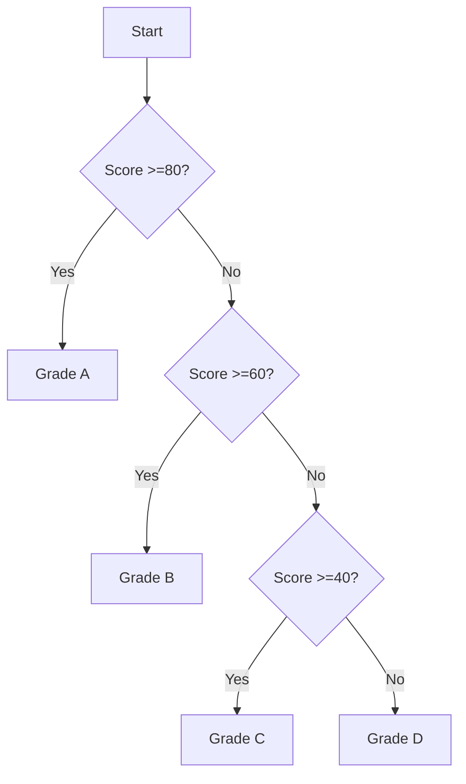

# Building Interactive JavaScript Programs: Number Checker & Grading System

```javascript
// ==============================
// 1. Divisibility Checker
// ==============================
const num = Number(prompt('Enter a number:'));

// Handle invalid inputs
if (isNaN(num)) {
  console.log('Please enter a valid number!');
} else {
  // Using modulo operator for divisibility check
  console.log(num % 5 === 0 
    ? `${num} is divisible by 5` 
    : `${num} is not divisible by 5`
  );
}

/*
Key Concepts:
- Modulo operator (%) returns division remainder
- Number() conversion for numerical input
- Template literals for clean string formatting
*/

// ==============================
// 2. Student Grading System
// ==============================
const score = Number(prompt('Enter your score (0-100):'));

// Input validation guard clause
if (isNaN(score) || score < 0 || score > 100) {
  console.log('Invalid score! Please enter between 0-100');
} else {
  // Grade determination logic
  if (score >= 80) {
    console.log('Grade: A 🎉');
  } else if (score >= 60) {
    console.log('Grade: B 👍');
  } else if (score >= 40) {
    console.log('Grade: C ✔️');
  } else {
    console.log('Grade: D ❌');
  }
}
```

---

## **Visual Breakdown**

### Grading System Logic


### Operator Quick Reference
| Operator | Name          | Example           | Use Case                  |
|----------|---------------|-------------------|---------------------------|
| `%`      | Modulo        | `10 % 3 → 1`      | Divisibility checks       |
| `===`    | Strict equal  | `5 === 5 → true`  | Type-safe comparisons     |
| `||`     | Logical OR    | `a || b`          | Input validation          |

---

## **Best Practices & Common Pitfalls**

1. **Always validate user input:**
   ```javascript
   // Bad: Directly uses prompt value
   // Good: Convert and validate
   const input = Number(prompt(...));
   if (isNaN(input)) { ... }
   ```

2. **Use inclusive/exclusive ranges carefully:**
   ```javascript
   // 80-100 (inclusive)
   score >= 80 && score <= 100
   
   // Simplified version
   score >= 80  // Since we already validated <=100
   ```

3. **Avoid magic numbers:**
   ```javascript
   // Instead of writing 80/60/40 repeatedly:
   const GRADE_A_CUTOFF = 80;
   const GRADE_B_CUTOFF = 60;
   ```

---

## **Try It Yourself Challenges** 🚀

1. **Enhanced Divisibility Checker**
   - Check divisibility by both 5 and 3
   - Add visual feedback using emojis (✨ for divisible, ❌ for not)

2. **Grading System Upgrades**
   - Add +/- grades (A+, A-, B+, etc.)
   - Create a 7-point grading scale
   - Implement auto-retry for invalid inputs

3. **Convert to Switch Statement**
   ```javascript
   switch(true) {
     case (score >= 80):
       // Grade A logic
       break;
     // Add other cases...
   }
   ```

---

## **VS Code Pro Tips** 🔥

1. **Live Code Testing**:
   - Install "Code Runner" extension (Ctrl+Alt+N to run code)
   - Use Quokka.js for real-time results

2. **Input Simulation**:
   ```javascript
   // Temporary override for testing
   // const prompt = () => 85; // Uncomment for testing
   ```

3. **Debugging**:
   - Set breakpoints on condition checks
   - Watch variables in debug console

---

**Food for Thought** 🤔  
What would happen if we used `==` instead of `===` in these examples?  
How could you modify this code to handle letter grade inputs instead of numbers?
